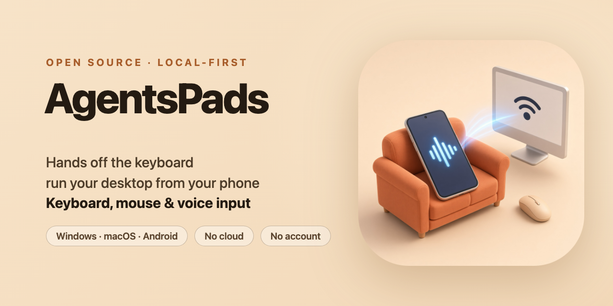

<div align="center">

<!-- Banner / Meme -->
<p align="center">
  
</p>

# AgentsPads

**Hands off the keyboard and mouse. Pick up your phone as the ultimate command surface — lean back, kick your feet up, or relax on the sofa while your AI Agent works at full throttle!**

<p align="center">
  <b>🇺🇸 English</b> | <a href="README.zh-CN.md">🇨🇳 简体中文</a>
</p>

<p align="center">
  <a href="LICENSE"></a>
  
  
  
  
</p>

[Download latest](https://github.com/MitsukiJoe/AgentsPads/releases/latest) · [Features](#features) · [Usage](#usage) · [Build](#build) · [FAQ](#faq)

</div>

> **"Wait! Are you still hunching over your desk like a medieval monk, glued to your monitor for ten hours straight?!"**  
> Stiff neck? Sore shoulders? Lumbar muscle strain? That herniated disc sounding alarm bells?  
> We're in the AI era — why on earth are you still sacrificing your spine just to hit Enter on an Agent confirmation every five minutes?!  
> **Stop! You don't have to suffer like this!**  
> Introducing **AgentsPads** — the dedicated remote "walkie-talkie" built for desktop AI Agents!
>
> *" 🕺 Better use AgentsPads! "*

---

> **Notice**:  
> AgentsPads operates strictly over your local network — it is not a remote desktop, and zero data goes through any cloud relay.  
> Please keep your computer unlocked and place the cursor in the field where you want input to land.  
> macOS requires Accessibility permissions (otherwise system keystroke and cursor injection cannot function).  
> The desktop daemon natively supports Windows and macOS; the mobile client is Android.
> My neck and back filed a workplace complaint, so I built this.

---


<p align="center">
  
</p>

## Why AgentsPads? — Stop the Desk Strain, Command from Comfort!

You bought the most expensive ergonomic chair, yet you're still stuck leaning forward, hunching over your keyboard all day?

With AgentsPads, you can stay ten feet away from your desk:

- **Lean all the way back in your ergonomic chair**, or kick your feet up on the desk;
- **Or collapse flat on the sofa across the room**;
- Step away from the screen, ditch the keyboard and mouse, and hold just your phone to command any Agent on your computer like a walkie-talkie!

It keeps the conversation with your Agents moving while giving you fewer reasons to stay hunched over the keyboard all day.

And it doesn't stop at commanding Agents.  
While your Agent is grinding through code or running deep research in the background and you want to chill with some videos? **You don't even have to get up!**  
Use the **trackpad, trackball, or pointing stick** at the bottom of your phone screen to switch windows, open your browser, jump to YouTube or a streaming site, and voice-search what you want to watch — **many everyday actions no longer require a trip back to the keyboard.**

---

<a id="features"></a>

## Core Features

AgentsPads is a hands-off input solution built for the Agent era — a dedicated "remote control + walkie-talkie" for your desktop.  
Voice is just one pathway, not the whole story.  
Once the target has focus, typing, custom shortcuts, and pointer controls can continue from your phone.
AI Agents are the prime use case, but the same workflow also applies to browser research, chat replies, and most ordinary windows that accept keyboard and pointer input.

#### Text Input

- **Command from across the room** — Sit comfortably on the other side of the room. Speech, typing, tapping shortcuts, and moving the cursor all happen on your phone. When an Agent asks "Which option do you want?", you can answer without heading back to the desk for every keystroke.
- **Voice typing, walkie-talkie style** — Dictate using Gboard or your favorite voice-enabled Android keyboard. Transcribed text automatically lands at the desktop cursor once speech stabilizes. Stability delay is configurable: instant (no delay), 0.5s, 1s, or 1.5s (0.5s default). This pause gives voice keyboards with AI formatting and punctuation restructuring enough time to finalize and polish the transcript. You can also turn off auto-send to review and edit before sending.
- **Dedicated send button** — True send control — you decide when the buffer goes out. Auto-send can stay enabled for an instant walkie-talkie flow, or stay disabled when you want to refine drafts first.
- **Typing is a first-class citizen** — Skip the microphone whenever you prefer. Draft and refine on your phone screen, then hit send. Especially useful in noisy environments, when prompt phrasing must be exact, or when your attention is already on the phone.
- **No desktop IME re-composition** — Text finishes composition on your mobile keyboard. Once placed on the desktop clipboard, it is pasted at the caret using native system shortcuts (`Cmd+V` or `Ctrl+V`). The desktop OS receives a clean paste command, not a sequence of simulated keystrokes that might trigger IME candidates or unwanted autocompletion.
- **Shortcut keys right under your thumb** — When an Agent stops and waits for Esc, Enter, or Shift+Enter, tap the row below the input box. Key bindings can be customized and expanded freely without being locked into any specific agent tool.
- **Genuine system key injection** — Shortcuts inject real keydown and keyup events into the operating system, rather than pasting dummy characters into the box. Esc actually cancels, Enter actually confirms, and Shift+Enter triggers whatever the target application binds it to.
- **Empty-box Backspace reaches the desktop** — When the phone input box is focused and empty, Backspace injects a real system Backspace on every checked computer, deleting whatever sits before the desktop caret. If the box still has text, Backspace only edits the phone-side draft. Soft keyboards and hardware keys both take this path.
- **Empty-box Send button becomes an Enter key** — Same "is the box empty?" check: when the input box holds no text, the paper-plane icon on the Send button swaps to a return-arrow icon, and tapping it injects a single real Enter on every checked computer, so you don't have to hunt for it in the shortcut row. The moment any text appears, the icon flips back to the paper plane and the button goes back to sending text.
- **Optional automatic Enter** — After text lands, AgentsPads can automatically press Enter so the Agent gets straight to work. After a successful paste, it waits 80ms to let the focused application consume the paste before firing Enter; normal text sync and manual Enter shortcuts are not delayed. If the Agent is asking you to pick an option rather than submit, simply toggle this switch off.
- **Undo last input** — Sent the wrong prompt? Tap to send `Ctrl+Z` / `Cmd+Z` to the desktop to undo in standard text fields (terminals and command lines may not support this undo depending on host configuration).

#### Cursor & Pointer Controls

- **Trackpad** — Single-finger move and tap to click, hold and move to drag, hold with slight movement or two-finger tap for right-click, and two-finger vertical swipe to scroll.
- **Trackball** — Roll the virtual glossy red ball for smooth relative pointer movement, with integrated left/right buttons and scroll wheel on the same compact base.
- **Pointing Stick** — Press and nudge the center directional nub for continuous relative motion. Buttons, scroll wheel, and base footprint match the trackball layout, ensuring zero layout shift when switching modes.
- **True double and triple clicks** — Consecutive taps in the same place within a short window carry the system single / double / triple-click count, so macOS can select a word or a line. A drag breaks the sequence and will not be counted as a double-click.
- **Optional long-press haptic** — The trackpad can give a light haptic tap when a long-press arms drag or right-click. It is on by default and can be turned off in settings.
- **Reversible scroll wheel side** — Switch the scroll wheel to the left or right side in settings; trackpad, trackball, and pointing stick adapt together.
- **Configurable pointer & wheel speeds** — Adjust Windows and macOS independently. Pointer speed ranges from ×1 to ×7 on both platforms (default ×3). Wheel speed ranges from ×1 to ×7 on Windows (default ×1), and offers ×4 / ×8 / ×12 / ×16 / ×20 / ×24 / ×28 on macOS (default ×16). Sliders display the actual multipliers, and scroll direction can be reversed separately for each platform.
- **Trackpad height tiers** — Small, Medium, and Large presets adjust trackpad height only; trackball and pointing stick retain their intrinsic compact height.
- **Landscape split and lock** — In landscape with enough width, the pointer pane and the input pane sit side by side. Settings choose whether the pointer sits on the left or the right (right by default), and a "Force landscape" switch can lock the orientation.

#### Additional Capabilities

- **Multitask while Agents work** — Want to pass the time while the Agent crunches through tasks? Use the virtual trackpad, trackball, or pointing stick to switch over to your browser, open YouTube or streaming sites, and use voice input to search videos — all without getting off the couch.
- **Landscape pairing window with a first-run guide** — The desktop pairing window uses a landscape layout with three tabs: Pairing, Settings, and About. The Pairing tab shows the QR code on the left and the copyable address, pairing code, and adapter list on the right; Settings gathers launch at login, diagnostic logs, and the pairing-key reset; About shows the version, license, update status, and this computer's device details. A connection guide pops up once on first launch, and the ⓘ button in the upper-left corner brings it back at any time.
- **Active NIC switching beside the QR code** — Computers may have Ethernet, Wi-Fi, tunnel, or virtual-network adapters enabled at the same time. The pairing window lists only adapters reported as active that have a candidate IPv4 address suitable for a local or virtual-network connection, labels them as Ethernet, Wi-Fi, tunnel, or virtual adapter and sorts them in that order. Select the one your phone can reach in the adapter list to the right of the QR code, and both the QR code and the copyable address follow it. With many adapters the list scrolls internally while the window size stays fixed.
- **Desktop listener on all interfaces** — The server listens on `0.0.0.0:9618` rather than binding only the primary adapter. A selected address can accept connections when it is reachable and the local firewall allows TCP 9618.
- **Scan without a code, or type the address plus a pairing code** — The QR code carries the pairing key, so a single scan completes pairing. If you would rather not use the camera, copy the `IP:port` from the pairing window to the phone and enter the 4-digit one-time pairing code shown in the same window. The code is valid only while the pairing window is visible and is replaced after each use; 5 wrong attempts in total lock it until you click "New code" on the computer.
- **Only paired phones get in** — On every connection the computer sends a random challenge and the phone answers with an HMAC computed from the pairing key; the computer processes no input until the check passes. "Reset pairing key" on the pairing window's Settings tab (click again to confirm) revokes every paired phone at once.
- **Manage multiple computers from one phone** — Keep laptops and desktops connected at the same time. Scanning another machine appends it to your device list without kicking existing connections. The target strip quickly chooses which computers receive the current input. It sits below the input box by default, and settings can move it next to "Connected" in the top bar.
- **Rename, edit IP, and manual addition** — Tap "Connected" in the upper-left corner to open the device-management dialog, where you can rename devices, update IPs, refresh connections, add devices with `+`, reorder, or delete.
- **Local LAN only, zero accounts** — Complete privacy: no registration, no login, no cloud relays.
- **Auto-reconnect on screen wake** — Waking your phone from sleep automatically re-polls the saved address pool to restore the link.
- **Quiet update checks** — All three clients share one check rhythm: silent background checks after launch and every 24 hours. A newer release appears as a quiet in-app indicator; the confirmation dialog opens only after you choose to view the update, and nothing downloads until you confirm.
- **User-controlled launch at login** — The Settings tab of the desktop pairing window provides a launch-at-login toggle that is off by default. Windows registers it through the Startup folder; packaged macOS apps use a LaunchAgent. Disabling the toggle removes the corresponding login entry.
- **Windows administrator mode (optional)** — Windows running with administrator rights, such as Task Manager, reject keys and pointer input injected by ordinary programs. Turn on "Launch as administrator" in Settings and approve one UAC prompt, and AgentsPads restarts as administrator; from then on, both launch at login and manual launches run as administrator without further prompts. After you turn it off, the next launch returns to normal privileges. Administrator mode uses its own pairing key, stored in a directory only administrators can access, so your phone needs to scan the QR code again after you turn it on and after you turn it off (it is still the same computer entry). In administrator mode, the theme, the first-run guide flag, and diagnostic logs are kept in `%ProgramFiles%\AgentsPads\state`. In administrator mode, launch at login is handled by a highest-privilege scheduled task with a logon trigger (about a 30-second delay), so AgentsPads starts directly as administrator after you sign in, and the toggle can be changed right in the administrator window; after you turn administrator mode off, launch at login returns to the normal setting from before administrator mode was turned on.
- **Friendly with Remote Desktop and Virtual LANs** — Accessing a remote desktop from outside, or connecting phone and PC via ZeroTier, Tailscale, or a similar virtual LAN? Active tunnel and virtual-network adapters appear in the pairing window so the QR and copyable address can follow the selected route. Inactive adapters are hidden, and common Docker or VM interfaces that can be clearly identified as machine-local are filtered out.
- **Saved candidate address pool** — Optionally save multiple candidate IPs per machine (Wi-Fi, Ethernet, secondary adapters). When switching networks, the phone retries the pool automatically without relying on unreliable UDP broadcasts.

---

<a id="usage"></a>

## Quick Start (3 Simple Steps)

### 1. Download

Open the [Latest Release](https://github.com/MitsukiJoe/AgentsPads/releases/latest) for release notes, or download the latest stable build for your system:

<div align="left">
<table>
  <thead align="left">
    <tr>
      <th>OS</th>
      <th>Download</th>
      <th>Requirements</th>
    </tr>
  </thead>
  <tbody align="left">
    <tr>
      <td>Windows</td>
      <td><a href="https://github.com/MitsukiJoe/AgentsPads/releases/latest/download/agentspads-windows-x64.exe"></a></td>
      <td>Windows 10 / 11 (64-bit)</td>
    </tr>
    <tr>
      <td>macOS</td>
      <td><a href="https://github.com/MitsukiJoe/AgentsPads/releases/latest/download/agentspads-macos-arm64.dmg"></a></td>
      <td>Apple Silicon (M1 or later)</td>
    </tr>
    <tr>
      <td>Android</td>
      <td><a href="https://github.com/MitsukiJoe/AgentsPads/releases/latest/download/agentspads.apk"></a></td>
      <td>Android 5.0 or later</td>
    </tr>
  </tbody>
</table>
</div>

---

### 2. Connect

```text
Launch desktop app → Ensure phone & PC are on the same LAN (or hotspot/VLAN) → Pairing QR code pops up
→ Confirm and select the subnet IP matching your phone in the adapter list beside the QR → Scan the QR, or paste "IP:port" manually and enter the 4-digit pairing code
```

- **Windows Users**: Run `agentspads-windows-x64.exe`. Allow TCP **9618** through the firewall if prompted. On first launch, if "Windows protected your PC" appears, click the "More info" link in the dialog, then click "Run anyway" in the button that appears below to launch the app. If the PC uses Ethernet while the phone is on Wi-Fi, switch to the Wi-Fi adapter IP in the adapter list. To control administrator windows such as Task Manager, turn on "Launch as administrator" in Settings.
- **macOS Users**: Open the `.dmg`, drag the app into Applications, and right-click → Open on first launch. Grant Accessibility permissions when prompted (essential for key and cursor injection).
- **Android Users**: Install the APK. To pair for the first time or manage a computer, tap "Connected" in the upper-left corner to open the full device-management dialog, then tap the scan icon; or tap `+`, paste the copied desktop address, and enter the 4-digit pairing code shown in the pairing window.

> "Connected" in the upper-left corner opens the full dialog for adding, editing, reordering, or deleting devices. The target strip only provides quick checkboxes for choosing which paired computers receive the current input; it sits below the input by default, and settings can move it to the top bar.

#### First Launch on macOS

If macOS blocks AgentsPads the first time you open it, use either option below. First make sure the app came from this project's official GitHub Release and has been moved into Applications.

##### Terminal Command

Open Terminal, then copy and run:

```bash
xattr -dr com.apple.quarantine /Applications/AgentsPads.app
```

Open AgentsPads again when the command finishes.

##### Graphical Steps

1. Open **System Settings → Privacy & Security → Security**;
2. Find the AgentsPads notice and click **"Open Anyway"**;
3. Confirm with your password or Touch ID;
4. Return to Applications and open AgentsPads again.

> There is no need to disable Gatekeeper, and `spctl --master-disable` is not recommended.

---

### 3. Start Using

1. **Focus the Caret**: Click where you want text to land on your computer (AI Agent input, chat window, browser search bar, IDE, etc.) using your mouse or phone trackpad.
2. **Input Freely**: Pick up your phone, type in the text box, or activate voice typing (e.g. Gboard). Text can auto-send when you pause, or you can tap the **Send** button manually.
3. **Respond to Prompts**: When the Agent pauses for your choice, tap Esc / Enter / Shift+Enter (or your custom shortcuts) right below the input box.
4. **Remote Control**: Switch apps or navigate the cursor using the trackpad, trackball, or pointing stick at the bottom.

> **Tip**: When the Agent stops and waits for your choice, you can toggle off **Automatic Enter** first; keep it on when you want every spoken prompt submitted immediately.

---

<a id="faq"></a>

## FAQ

**Q: Why won't my phone connect to my computer?**  
**A:** First confirm that your phone and PC are on the same local network, phone hotspot, or virtual LAN (such as ZeroTier / Tailscale) where both sides can unicast, and that your computer's firewall allows TCP 9618.  
In the adapter list beside the pairing QR code, switch to an active Wi-Fi, Ethernet, tunnel, or virtual-network address that your phone can reach, then scan again or paste that address. If an expected virtual-network address is missing, first confirm that the network is connected and has assigned an IPv4 address; inactive adapters and adapters without a candidate IPv4 address are omitted.
macOS users: make sure AgentsPads is granted "Accessibility" permissions under System Settings.

**Q: My phone stopped connecting after an upgrade, or after the computer reset its pairing key. What now?**  
**A:** Connections require a pairing key. Device entries saved by older versions have no key, so the device-management dialog shows them as "Not paired"; after the computer resets its pairing key, the phone shows the device as "Rejected". Scan the QR code again, or enter the 4-digit code currently shown in the pairing window when editing the device.

**Q: Why did injected text or mouse clicks land in the wrong application?**  
**A:** Desktop injection strictly targets the currently active system focus. Make sure you click and activate the target input box or window before sending.

**Q: Are there any text pasting limitations?**  
**A:** AgentsPads delivers plain text.  
Certain protected input boxes (such as secure password fields) or software that disables/remaps system paste shortcuts may reject input.  
macOS retains the sent text on the system clipboard; Windows restores the previous text clipboard content shortly after pasting (non-text items like images are not restored).

**Q: Does voice auto-send work with all third-party keyboards?**  
**A:** AgentsPads never guesses input sources from text length, typing speed, or intermediate composition states. Instead, it requires strict source evidence: an Android recording session starting after the input box gains focus, or an IME explicitly declaring `voice` mode (such as Gboard voice typing).  
AgentsPads only detects system recording status flags — it never captures or reads actual audio data, and requires no microphone permissions from the user.  
Standard typing, composition, and clipboard pasting do not trigger auto-send on their own; an unrelated recording active at the same moment remains subject to the Android anonymity edge case below.
After voice composition concludes, the system counts down the configured delay (default 0.5s, resetting if the IME continues AI formatting), ensuring AI-assisted voice keyboards have ample time to output final polished text.  
Because Android anonymizes recording sources for standard apps, an unrelated app starting a recording at the exact moment of focus represents a very minor theoretical false-positive boundary. Full details are viewable anytime via the info icon next to "Voice Auto-send Delay" in Settings.

---

## Technical Implementation and Constraints

| Module | Current Implementation | Constraints & Safety Boundaries |
| :--- | :--- | :--- |
| **Architecture** | Android phone client built with Flutter; desktop daemon built in pure Rust for Windows and macOS | Strictly no Electron, Python runtime, or Flutter desktop shells, ensuring minimal resource footprint; the desktop pairing window repaints only when adapters, permissions, the pairing code, or update status change, or on user input, and presents no frames while idle |
| **Android Native Bridge** | Lightweight native Kotlin module: binds to physical Wi-Fi only for same-subnet targets, manages OkHttp WebSocket connections, monitors anonymous recording state, inspects the IME subtype, and forwards an IME Backspace to the desktop when the input box is empty | UI rendering, reactive state, and gestures remain in Flutter; never records audio, requests no microphone permissions |
| **Transport & Protocol** | Phone connects to desktop TCP `9618` via plain LAN WebSockets; messages use a fixed JSON schema. On every connection the desktop first sends a random challenge, and the phone must answer with an HMAC-SHA256 computed from the pairing key (or, for a first manual pairing, submit the 4-digit pairing code); connections that do not pass within 10 seconds are closed | No cloud relays, no user accounts, no external internet dependency; **authentication only blocks unauthorized devices from connecting; traffic is not encrypted. Anyone who can capture packets on the same network can read the text you send, and anyone who can intercept traffic can tamper with input. Use on untrusted networks (public Wi-Fi, shared offices, etc.) is not recommended; do not expose the port to the public internet** |
| **Desktop Listener** | Daemon listens on `0.0.0.0:9618`, never binding exclusively to a single network interface | Ethernet, Wi-Fi, and hotspot addresses can connect when the endpoint is unicast-reachable and local firewall rules allow TCP 9618 |
| **Pairing Mechanism** | Desktop displays a system DPI-scaled (~260pt) crisp QR code alongside a copyable `IP:port`; active physical, tunnel, and virtual-network adapter IPv4 addresses are switchable in the adapter list beside the QR. The QR carries the pairing key; manual address entry requires the 4-digit one-time pairing code shown in the pairing window (invalid once the window is hidden, replaced after each use, locked after 5 wrong attempts in total), after which the desktop hands out the pairing key | Inactive adapters and adapters without a candidate IPv4 address are filtered; common container/VM interfaces that can be clearly identified as machine-local are also excluded; phone also supports manual entry and persistent candidate IP pools. During manual pairing, both the code and the key handed out afterwards travel in plaintext, so they can still leak if someone is eavesdropping at that moment; "Reset pairing key" on the pairing window's Settings tab revokes every paired phone |
| **Multi-Device Management** | Each computer maintains an independent WebSocket connection with its own reconnect logic; the phone uniformly sends to all checked, activated online targets; the target strip sits below the input by default and can be moved next to "Connected" in the top bar | Input box on phone clears immediately once any checked target succeeds; does not block on ACK from every machine. Connections and retries stop while the phone app is hidden and resume automatically when it becomes visible |
| **Text Injection Pipeline** | Text finishes composition on the phone keyboard; desktop writes plain text to clipboard, then injects genuine `Ctrl+V` / `Cmd+V`. If Automatic Enter is active and paste succeeds, system waits 80ms for the target app to digest text before sending Enter | Desktop receives standard paste shortcuts rather than simulated keystrokes for `v`; secure fields or apps disabling paste may reject input. Normal text sync and manual Enter bypass this 80ms delay |
| **Voice Detection Logic** | Focus must be accompanied by active Android recording or an IME subtype declaring `voice`; cursor must be at end of text, with no selection and finished composition | Relies on low-level source evidence rather than text heuristics, preventing typing or paste alone from triggering auto-send and supporting standard voice IMEs without whitelists. Configurable stability delay (0 / 0.5s / 1s / 1.5s, default 0.5s) allows AI restructuring time. Recording detection requires Android 7+; Android 5/6 relies on `voice` subtype. Concurrent unrelated recording is the remaining theoretical edge case |
| **Shortcut Injection** | Phone sends key + modifiers; Windows calls `SendInput`, macOS calls `CGEvent` to inject genuine keydown / keyup events. When the input box is focused and empty, a soft-keyboard or hardware Backspace follows the same path and injects `Backspace` without using the shortcut row; when the input box is empty the Send button switches to a return-arrow icon and tapping it injects `Enter` through the same path | One unified global shortcut mapping; no per-application configuration profiles. Empty-box Backspace is forwarded only while the phone input still has focus and contains no text; leftover draft text is edited on the phone only. Empty-box Enter shares that same empty-box check with Backspace; as soon as the box holds text the Send button reverts to sending text |
| **Undo Mechanism** | Phone instructs target computers to inject `Ctrl+Z` on Windows or `Cmd+Z` on macOS, restoring the last sent draft back into the phone input | Undo efficacy depends on target application undo history; terminals and CLI tools may ignore or reinterpret shortcut; executed commands and terminal output cannot be rolled back |
| **Pointer & Cursor Control** | Phone transmits relative deltas, button bitmaps, and logical-pixel scroll deltas; default rates match display's **peak supported refresh rate** (60Hz or 120Hz; ≥90Hz defaults to 120Hz, failure defaults to 60Hz), with manual 240Hz option; Android window requests peak refresh to prevent frame throttling; separate Windows / macOS settings adjust pointer speed (×1–×7 on both, default ×3) and wheel speed (Windows ×1–×7, default ×1; macOS ×4–×28 in steps of ×4, default ×16), with independent scroll direction settings; injected via `SendInput` / `CGEvent`; macOS consecutive taps write the system click count (about 500ms and 5pt, up to triple-click; a drag breaks the sequence) | Strictly no fabricated path interpolation. When multiple deltas arrive within a single display refresh, cursor may appear to jump — this is delayed motion drawn at once, not misplacement; round trips maintain strict zero-drift precision. Trackpad / trackball / pointing stick share speed & wheel side configs; not physical HID hardware, not intended for esports or multi-display absolute mapping |
| **Local State Persistence** | Android stores device lists, selection states, shortcuts, themes, voice delays, input heights, pointer modes/sizes/speeds/rates, wheel speed/side/direction, device-strip placement, landscape layout, force-landscape, and long-press haptic via `SharedPreferences` | Zero remote account synchronization; 100% of configuration and historical data remains strictly on the local device |
| **System Permissions** | Android requires network access and camera permission for QR scanning; voice detection requires no microphone permission; macOS requires "Accessibility" under System Settings for key and cursor injection | macOS Accessibility TCC and code signing are separate mechanisms; Windows Firewall must allow LAN TCP 9618 traffic |
| **Desktop Launch at Login** | The Settings tab of the desktop pairing window provides a default-off launch-at-login toggle; Windows creates or removes an entry in the Startup folder, while packaged macOS apps create or remove a LaunchAgent under `~/Library/LaunchAgents/` | The local login entry is written only after explicit user opt-in, requires no network access or elevation, and is removed when the toggle is disabled |
| **Windows Administrator Mode** | "Launch as administrator" on the Settings tab is off by default; enabling it asks for UAC approval once and registers a scheduled task that runs with highest privileges, through which every later manual launch silently restarts as administrator, while launch at login is handled by a second task with a logon trigger that starts directly as administrator | Windows only; takes effect only after explicit opt-in and UAC approval, and exists to inject input into administrator windows such as Task Manager; the next launch after turning it off runs with normal privileges; the administrator instance keeps its pairing key separate from the normal instance, in a directory only Administrators/SYSTEM can access, so ordinary processes cannot read it and phones must re-scan after switching modes; if the scheduled task stops working (for example, the EXE was moved), AgentsPads runs with normal privileges and turns the toggle off so it can be re-registered; the administrator instance stores its theme, guide flag, and diagnostic logs in `%ProgramFiles%\AgentsPads\state` (permissions inherited from the program directory, readable by ordinary users); in administrator mode, launch at login is a second highest-privilege scheduled task with a logon trigger (about a 30-second delay), switched on and off by the administrator instance with `schtasks /Change` without writing to the user profile; turning administrator mode on removes the old Startup-folder entry, and turning it off returns to the normal setting from before; later launches start as administrator only when a marker in that program directory says so |

---

## Log Locations

Diagnostic logs are off by default and apply only to the current run. When you hit connection issues or unexpected behavior, turn on "Diagnostic logs" on the pairing window's Settings tab (enabling it clears old logs), reproduce the problem, then click "Open folder" or choose "Open Logs" from the tray menu; "Clear" deletes existing logs at any time. Logging turns itself off when AgentsPads restarts. Log locations:

- **Windows**: `%APPDATA%\AgentsPads\logs\`; in administrator mode, `%ProgramFiles%\AgentsPads\state\logs\`
- **macOS**: `~/Library/Logs/AgentsPads/`

---

## Automatic Checks and Confirmed Updates

AgentsPads uses a lightweight cross-platform update channel. Every stable Release includes a small manifest containing the version, download URLs, and SHA-256 values. Clients read the GitHub Release asset first and fall back to two CDN mirrors, avoiding dependence on GitHub REST API quotas. All three clients share the same check rhythm; downloads and installation always require user confirmation, and the app never updates itself unattended:

- **Automatic check schedule**:
  - The desktop and Android apps perform one background check after every launch;
  - While an app remains running, it checks again every 24 hours from startup. Restarting starts a new process and therefore performs another launch check;
  - Checks use an in-process HTTPS client and fall back through the CDN mirrors when the primary source is unavailable; they never open CMD, a terminal, or an unattended download;
  - Background checks and automatic notifications do not open dialogs on their own: desktop shows a clickable update entry beside the version number in the window's top bar only when a newer release is found, and keeps the check status on the About tab. On Android, a newer release appears as a green dot and an "Update" badge beside the version number at the bottom of the home screen; the confirmation dialog opens only after you tap it. The manual "Check for Updates" command reports checking, up-to-date, or failure.
- **Visible version status**:
  - The desktop pairing window's top bar always shows the running version beside the listening port; the About tab shows the latest check result and offers a manual "Check for Updates";
  - When a newer release is found, an "**Update to vX.Y.Z**" button appears beside the top-bar version and on the About tab. Download and replacement begin only after the user clicks it.
- **Windows (In-Process Download and Self-Replacement)**:
  - After the user clicks "Update to vX.Y.Z," AgentsPads downloads the new `agentspads-windows-x64.exe` through its in-process HTTPS client and reports progress in the UI; it does not invoke CMD, an updater script, or the system `curl`;
  - Once the download completes, AgentsPads verifies its SHA-256 value before renaming the running EXE to `.old`, placing the new executable at the original path, and relaunching. A failed verification or replacement keeps the previous version and surfaces the reason in the UI;
  - On startup, AgentsPads removes `.old` / `.new` update residue. A legacy `agentpad_updater.bat` left by older releases is removed only when its contents match the former AgentPad updater, avoiding accidental deletion of user files.
- **macOS (Automatic App Bundle Swap)**:
  - After the user clicks "Update to vX.Y.Z," AgentsPads downloads `agentspads-macos-arm64.zip`, verifies its SHA-256 value from the manifest, and only then extracts it;
  - When running from any `.app` bundle in a writable location, AgentsPads renames the old bundle aside, places the new bundle at the original path, and launches it through `open -n`; this is not restricted to `/Applications`;
  - If the bundle cannot be swapped by rename, AgentsPads falls back to an in-place `ditto` copy. Only non-bundle development builds open the extracted directory for manual handling; no DMG mount is required.
- **Android (System Installer Confirmation)**:
  - The bottom of the home screen permanently shows the current version number, following the same background check after launch and every 24 hours;
  - When an automatic check finds a newer release, only a green dot and an "Update" badge light up beside the version number, with no dialog; tapping it opens the release notes, and only after tapping "Download & Update" does AgentsPads download `agentspads.apk` and open the system installer. The application id is `app.agentspads`. An in-place install of that same id, signed with the same key, retains saved devices and preferences. An existing install whose id is still `app.agentpad` is left in place; install the new package separately, and data from the old app does not come along.

---


<a id="build"></a>

## Project Structure

```text
AgentsPads/
├── desktop/                 # Desktop daemon (Pure Rust core: Windows / macOS)
│   └── crates/
│       ├── agentpad/        # System tray, pairing UI window, WebSocket server
│       └── agentpad-input/  # Plain text injection, system keystrokes & cursor engine
├── android/                 # Mobile client (Android application)
│   ├── lib/                 # Flutter UI, state management, gesture recognizers, protocol client
│   └── android/app/src/main/kotlin/
│       └── app/agentspads/  # Physical Wi-Fi binding, WebSocket client, voice evidence native bridge, empty-box Backspace
├── LICENSE
├── README.md
└── README.zh-CN.md
```

## License

This project is licensed under the [GNU Affero General Public License v3.0 (AGPL-3.0)](LICENSE).
