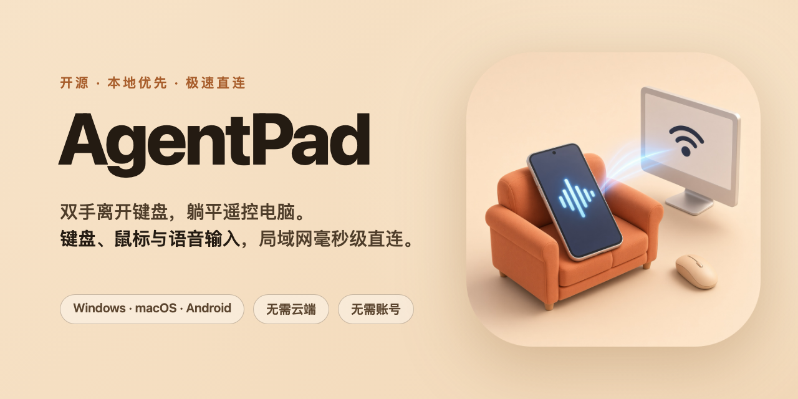

<div align="center">

<!-- Banner / Meme -->
<p align="center">
  
</p>

# AgentPad

**双手离开键鼠，拿起手机化身全能遥控器 —— 坐着、躺着、翘着腿，你的 AI Agent 照样全速开工！**

<p align="center">
  <a href="README.md">🇺🇸 English</a> | <b>🇨🇳 简体中文</b>
</p>

<p align="center">
  <a href="LICENSE"></a>
  
  
  
  
</p>

</div>

> **「等等！你还在每天像个“不是，哥们.jpg”一样，在电脑屏幕前弓腰十几个小时吗？！」**  
> 颈椎僵硬？肩周酸痛？腰肌劳损？腰椎间盘突出亮起红灯？  
> 难道进入了 AI 时代，我们还得为了每隔几分钟给桌面上跑着的 Agent 敲个回车确认，而献祭掉自己的整条脊椎？！  
> **快停下！你不需要这样受罪！**  
> 隆重向你推荐 **AgentPad** —— 专为 AI Agent 时代打造的「遥控对讲机」！
>
> 「 🕺 Better use AgentPad! 」

---

> **说明**：  
> AgentPad 纯走局域网，不是远程桌面，绝不经云端转发。  
> 请保持电脑处于解锁状态，并将输入光标提前点在要接收文字的位置。  
> macOS 系统需要开启辅助功能权限（否则系统按键与光标无法注入）。  
> 桌面端目前原生支持 Windows 与 macOS，手机端为 Android。
> 该项目是我为了缓解我自己的职业病疼痛而创建的。

---


<p align="center">
  
</p>

## 为什么要用 AgentPad？—— 告别工伤，躺平掌权！

你买了最贵的人体工学椅，却依然逃不过脖子前倾弓着腰伏案敲键盘的命运？

有了 AgentPad，你可以彻底离开电脑桌三米远：

- **尽情仰靠在人体工学椅上**，甚至把双腿大摇大摇地翘到办公桌上；
- **或者直接往办公室后面的沙发上四仰八叉一躺**；
- 离开屏幕、甩开键盘鼠标，手里只握着手机，就能像拿着对讲机一样随心所欲指挥电脑上的任何 Agent！

不仅能提升与 Agent 来回沟通的效率，也能减少长时间弓腰守在键盘前的机会！

当然，它的本领可远不止使唤 Agent。  
当你的 Agent 正在后台疯狂跑代码、查资料，而你想趁机摸鱼看点视频打发时间？**根本不用爬起来碰电脑！**  
直接用手机底部的**触控板、轨迹球或经典小红点**划动光标，在电脑上切到浏览器、点开你最爱的视频网站，再用语音输入搜索想看的视频——**很多常见操作不用再回到键盘前！**

---


## 核心招牌特性

AgentPad 是 Agent 时代下另一套脱离键鼠的输入方案，你电脑专属的 "遥控器 + 对讲机"。  
语音只是其中一条路，不是全部。  
输入焦点就位后，打字、自定义快捷键和指针操作都可以继续在手机上完成。
Agent 是最佳用例；浏览器查资料、聊天框回消息，以及大多数接受普通键盘鼠标输入的窗口也能使用。

#### 文字输入

- **躺着指挥** — 人可以坐在房间另一头。说话、打字、点快捷键、划鼠标都在手机上完成。Agent 一问「选哪个」，不必每次都爬起来按键盘。
- **中文语音，对讲机式** — 用你最喜欢的语音输入法说话。语音文本可在稳定后自动落到电脑光标处，延迟可选无延迟、0.5 秒、1 秒或 1.5 秒，默认 0.5 秒；这段等待让带有 AI 自动整理排版功能的语音输入法有时间完成文字的排列和重组。也可关掉自动发送，先修改后再发。
- **独立发送按钮** — 真正的发送，由你决定缓冲区什么时候出门。语音自动发送可以开着当对讲机，也可以关掉，先编辑再发。
- **打字同样是主路径** — 可以不用麦克风。在手机上改好再按发送。房间吵、措辞必须精确、或注意力已经留在手机上时，这条路更顺。
- **电脑输入法不二次组字** — 文字在手机上完成组字，写入电脑剪贴板后，再用完整的系统粘贴快捷键（`Cmd+V` 或 `Ctrl+V`）落到光标处。电脑输入法收到的是粘贴命令，不是会弹出中文或日文候选框的普通字母 `v`。
- **快捷键就在手边** — Agent 停下来等人按 Esc、Enter、Shift+Enter 时，点输入框下面那一排。绑定可以改、可以加。不同 Agent 快捷键不同，这一排不写死某一家。
- **真正的按键注入** — 快捷键是电脑上的按下/抬起，不是往输入框里粘假字符。Esc 能取消，Enter 能确认，Shift+Enter 走该软件自己的绑定。
- **可选电脑自动回车** — 文字落地后可以再帮你按一次 Enter，让 Agent 立刻开工。粘贴成功后会先等待 80ms 再自动回车，让当前焦点应用先处理完粘贴；普通文字同步和手动 Enter 快捷键不受这段等待影响。它在问你「选哪个」而不是「提交」时，也可以把这个开关关掉。
- **撤回上次输入** — 会向电脑发送 `Ctrl+Z` / `Cmd+Z`，普通文本框里可一键撤回；终端和命令行可能不支持这种撤销。


#### 掌管光标

- **触控板** — 单指移动和单击，长按后移动直接拖拽，长按微动或双指点按是右键，双指上下滑动是滚轮。
- **轨迹球** — 拖动中间的光泽红球做相对移动，左右键和滚轮都在同一块底座上。
- **小红点** — 按住中心热区往方向推保持移动。按键、滚轮和底座与轨迹球完全同尺寸，切换时不抖动。
- **滚轮跟手换边** — 设置里选左侧或右侧，触控板、轨迹球、小红点一起切换。
- **指针与滚轮速度** — 设置里滑块调节；指针 ×1 / ×2 / ×3 / ×4（默认 ×2），滚轮 ×4 / ×8 / ×12 / ×16 / ×20 / ×24 / ×28（默认 ×16），档位标真实倍数。
- **触控板大小** — 小、中、大三档只改触控板高度；轨迹球与小红点保持紧凑固有尺寸，不跟档位变高。


#### 其他功能

- **一边派活一边摸鱼** — Agent 在电脑里干活的时候，想切到 B 站打发时间？用下方的触控板、轨迹球或小红点直接操纵鼠标切换到浏览器，再用语音输入搜你想看的东西——全程你可以在沙发上进行。
- **二维码下切换活跃网卡** — 电脑常常同时启用有线、Wi-Fi、隧道或虚拟组网。配对窗只列出系统报告为活跃、且具有适合局域网或虚拟组网连接的候选 IPv4 的网卡，并优先排列 Wi-Fi 与有线；在二维码下方切到手机能通的地址再扫。
- **电脑监听所有网卡** — 服务端监听 `0.0.0.0:9618`，不绑死第一张网卡；选中的地址在网络可达且防火墙放行 TCP 9618 时可用于连接。
- **扫码或填地址** — 二维码是一扇门。配对窗同时给出可复制的 `IP:端口`，手机可以只填名字和地址，不打开相机。
- **一部手机盯多台电脑** — 笔记本和台式可以同时连着。再扫另一台设备就是加机器，不会把已有连接踢掉。输入框下方的设备目标条用于快速勾选哪些电脑响应当前输入。
- **可改名、改 IP、手动加** — 点击左上角「已连接」打开设备管理弹窗，可修改显示名和地址、刷新连接、用 `+` 手动添加设备，也可排序或删除。
- **只走局域网，没有账号** — 保护你的隐私：不上传、不登录、不经云中继。
- **息屏再亮仍会重连** — 手机从黑屏回来，会再走一遍已保存的地址池。
- **不扰人的更新** — 三端同一套节奏：启动后与每满 24 小时在后台静默检查，发现新版只在界面安静提示，不弹任何窗口打断你的操作与思路；点一下才真正开始下载。
- **桌面端开机启动可控** — 配对窗口提供「开机启动」开关，默认关闭；Windows 通过 Startup 启动目录、macOS 打包 App 通过 LaunchAgent 注册，关闭后移除对应登录项。
- **远程桌面、虚拟局域网也友好** — 人不在家、靠远程桌面看着家里电脑时，或用 ZeroTier、Tailscale 这类工具（以及同类组网方式）把手机和电脑拉进同一虚拟局域网，只要两边能单播到对方，就可以正常配对使用。已连接并处于活跃状态的隧道和虚拟组网网卡会出现在配对窗中，二维码和可复制地址随选择切换；未启用网卡不会显示；常见且能明确识别为仅供本机使用的 Docker、虚拟机内部接口也会被过滤。
- **保存地址池** — 可选打开每台电脑一次性记下多个候选 IP（Wi-Fi、有线、额外的网卡等）。换网之后手机按池子重试。不靠 UDP 广播去找人。

---


## 快速上手（只需三步）


### 1. 下载程序

前往 [Latest Release（最新版本）](https://github.com/MitsukiJoe/AgentPad/releases/latest) 查看发布说明，或点击下表文件名直接下载最新正式版本：


| 平台          | 安装包文件                      | 系统要求                    |
| ----------- | -------------------------- | ----------------------- |
| **Windows** | [`agentpad-windows-x64.exe`](https://github.com/MitsukiJoe/AgentPad/releases/latest/download/agentpad-windows-x64.exe) | Windows 10 / 11（64 位）   |
| **macOS**   | [`agentpad-macos-arm64.dmg`](https://github.com/MitsukiJoe/AgentPad/releases/latest/download/agentpad-macos-arm64.dmg) | Apple Silicon（M1 及更新芯片） |
| **Android** | [`agentpad.apk`](https://github.com/MitsukiJoe/AgentPad/releases/latest/download/agentpad.apk)             | Android 5.0 及以上版本       |


---


### 2. 建立连接

```text
启动电脑端 → 确保手机与电脑在同一局域网（或开启手机热点/组网） → 电脑弹出配对码
→ 在二维码下方确认选中与手机同网段的 IP → 手机扫码，或复制「IP:端口」手动粘贴添加
```

- **Windows 用户**：直接运行 `agentpad-windows-x64.exe`。若系统弹出防火墙提示，请放行 TCP **9618** 端口。首次运行若弹出「Windows 已保护你的电脑」，点击提示中的「更多信息」链接，随后在下方出现的按钮中点击「仍要运行」即可打开。当电脑插网线而手机连 Wi-Fi 时，记得在二维码下方切换为无线网卡 IP。
- **macOS 用户**：打开 `.dmg` 安装包，将 App 拖入「应用程序」文件夹；首次启动请右键点击选择「打开」。系统弹出「辅助功能」权限申请时务必允许（按键与指针注入的核心依赖）。
- **Android 用户**：安装 APK。首次配对或管理电脑时，点击左上角「已连接」打开设备管理弹窗，再点击扫码图标或 `+` 粘贴刚复制的电脑地址。

> 左上角「已连接」用于打开完整的设备管理弹窗，执行添加、编辑、排序或删除；输入框下方的设备目标条只用于快速勾选哪些已配对电脑响应当前输入。

#### macOS 首次打开指南

当前 macOS 构建采用 ad-hoc 代码签名分发，首次双击启动可能被 Gatekeeper 拦截（提示应用已损坏或来自未识别的开发者）。处理步骤，**无需关闭 Gatekeeper**：

1. 首次双击被拦截后，进入「系统设置 → 隐私与安全性 → 安全性」；
2. 在拦截提示处点击「仍要打开」（Open Anyway）；
3. 输入密码或使用 Touch ID 确认；
4. 之后每次均可正常打开，无需重复此流程。

CLI 可选替代方案（仅限已确认从本项目官方 GitHub Release 下载构建的情况）：

```bash
xattr -dr com.apple.quarantine /path/to/AgentPad.app
```

> 无需关闭 Gatekeeper；不建议使用 `spctl --master-disable`（它会全局禁用系统验证）。

---


### 3. 开始使用

1. **就位光标**：在鼠标或者手机上触控板点击一下你希望输入落地的位置（AI Agent 输入框、聊天窗的输入框、浏览器搜索栏等）。
2. **随心输入**：拿起手机，直接在手机输入框打字，或开启手机语音输入法畅所欲言。说完后可等待其自动发送，也可手动轻按 **发送** 按钮。
3. **响应确认**：当 Agent 停下等待你的确认时，直接在手机下方点击 Esc / Enter / Shift+Enter（或你自定义的快捷键）。
4. **隔空操作**：想切换应用或移动光标？用下方的触控板、轨迹球或小红点滑动即可。

> **小贴士**：当 Agent 停下来等你选择时，可以先关闭 **电脑自动回车**；希望每说完一句话就直接提交执行时，则保持打开。

---


## 常见问题（FAQ）

**Q：手机为什么连不上电脑？**  
**A：** 请首先确认手机与电脑处于同一局域网、手机热点，或者在 ZeroTier / Tailscale 等虚拟组网内能够互相单播通信，且电脑防火墙已放行 TCP 9618 端口。  
在电脑配对界面的二维码正下方，请检查并切换到手机能真正访问到的活跃网卡 IP（Wi-Fi、有线、隧道或虚拟组网），然后再进行扫码或手动粘贴。若预期的虚拟组网地址没有出现，请先确认对应网络已连接并为电脑分配了 IPv4；未启用或没有候选 IPv4 的网卡不会进入列表。
macOS 用户请务必检查系统设置中是否已为 AgentPad 勾选授予「辅助功能」权限。

**Q：发送的文字或鼠标点击跑到其他软件里了？**  
**A：** 电脑端注入严格作用于当前的系统活动焦点。输入前请确保鼠标已点击激活了目标输入框或窗口。

**Q：粘贴文本有什么限制吗？**  
**A：** AgentPad 只负责投递纯文本。  
部分受安全策略保护的特殊输入框（如某些密码框），或禁用/重映射了系统粘贴快捷键的特定软件可能无法接收。  
macOS 系统会将发送的文字保留在系统剪贴板中；Windows 系统会在粘贴操作完成后迅速恢复原有的文本剪贴板内容（非文本类如复制的图片内容不会恢复）。

**Q：语音自动发送能完美适配所有第三方输入法吗？**  
**A：** AgentPad 坚决不通过文本长度、字数变化速度或组字中间态去盲猜来源，而是要求严谨的输入来源证据：输入框聚焦后系统捕获到 Android 录音活动，或当前输入法明确声明为 `voice` 模式。  
AgentPad 只检测系统录音活动标识，绝不抓取或读取任何实际音频，也无需向用户申请麦克风权限。  
普通键盘手打、组字和粘贴本身不会单独触发自动发送；若同一时刻存在其它应用录音，仍受下述 Android 匿名化边界影响。
语音输入组字完成后，会按照你所配置的延迟时间进行倒计时等待（默认 0.5 秒，期间若输入法继续进行 AI 排版整理会重新计时），确保搭载 AI 整理功能的语音输入法能够完整输出终稿。
由于 Android 系统会对普通应用匿名化录音来源，若在输入框聚焦的同一瞬间有其他独立应用恰好开始录音，存在极低概率的理论误判边界。  
详情可随时在设置页「语音自动发送延迟」旁的说明图标中查看。

---


## 技术实现与约束边界


| 模块               | 当前技术实现                                                                                                                                                                                                     | 约束与安全边界                                                                                                                                                                             |
| ---------------- | ---------------------------------------------------------------------------------------------------------------------------------------------------------------------------------------------------------- | ----------------------------------------------------------------------------------------------------------------------------------------------------------------------------------- |
| **系统架构**         | 手机端基于 Android Flutter；桌面端基于纯 Rust 构建，原生支持 Windows 与 macOS                                                                                                                                                  | 坚决不使用 Electron、Python 运行时或 Flutter 桌面壳，保证极低资源占用                                                                                                                                     |
| **Android 原生桥接** | 极简原生 Kotlin 模块：仅当目标位于物理 Wi-Fi 同网段时绑定该网络，并负责 OkHttp WebSocket 通信、匿名录音活动状态监听及输入法 subtype 读取                                                                                                                          | UI 界面、响应式状态与手势交互全部留在 Flutter 层；绝不录制任何音频，不申请麦克风权限                                                                                                                                    |
| **连接与通信协议**      | 手机端通过本地局域网明文 WebSocket 连接电脑端 TCP `9618`；通信采用固定格式的 JSON 数据包                                                                                                                                                 | 无云端中继、无用户账号、无外网依赖；仅限在可信局域网、受控热点或受信任虚拟组网中运行，切勿将端口映射暴露至公网                                                                                                                              |
| **桌面端网络监听**      | 服务端监听 `0.0.0.0:9618`，不绑定单一物理网卡                                                                                                                                                                              | 实体有线、Wi-Fi 与 Wi-Fi 热点等共享网络地址在可单播到达且本机防火墙放行 TCP 9618 时可连接                                                                                                                                           |
| **配对机制**         | 桌面端呈现依据系统 DPI 缩放（约 260pt）的高清二维码，并同步提供可一键复制的 `IP:端口`；二维码下方支持切换当前活跃的实体、隧道与虚拟组网网卡 IPv4                                                                                                                          | 未启用或没有候选 IPv4 的网卡会被过滤；常见且能明确识别为仅供本机使用的容器/虚拟机接口也会被排除；扫码非唯一通道，手机端也支持手动输入并持久化候选 IP 地址池                                                                                                        |
| **多设备管理**        | 每台电脑对应一条独立的 WebSocket 长连接，各自维护重连逻辑；手机端统一向勾选为激活的在线目标发射数据                                                                                                                                                    | 任意一个已勾选的目标机器发送成功即立即清空手机端本地输入框，不强制阻塞等待每台机器的回执 ACK                                                                                                                                    |
| **文字注入流程**       | 文字先在手机端输入法完成完整组字；电脑端接收后写入纯文本剪贴板，随即注入真实的 `Ctrl+V` / `Cmd+V`。当且仅当开启「自动回车」且粘贴成功时，系统会精准等待 80ms 留给焦点应用消化文本，随后发出 Enter                                                                                           | 电脑端接收到的是正规粘贴系统快捷键，而非模拟键盘敲击字符 `v`；安全保护输入框或禁用粘贴的程序可能拒绝接收。普通文字发送与手动 Enter 键不受该 80ms 影响                                                                                                 |
| **语音判定逻辑**       | 输入框获得焦点后，必须检测到底层 Android 录音活动，或输入法 subtype 明确标识为 `voice`；同时要求光标处于文末、无选区且已退出 composing 组字态                                                                                                                  | 基于底层来源证据而非字形猜测，避免由手打和粘贴本身单独触发，无需维护输入法白名单即可适配标准语音输入法。稳定延迟支持 0 / 0.5s / 1s / 1.5s（默认 0.5s），充分留出 AI 语音整理排版时间。录音状态检测需 Android 7+；Android 5/6 依赖 `voice` subtype。因系统匿名化机制，并发的无关录音是剩余理论边界 |
| **快捷键注入**        | 手机端发送 key + modifiers；Windows 端调用底层 `SendInput`，macOS 端调用 `CGEvent` 注入真实的 keydown / keyup 事件                                                                                                               | 全局统一维护一套自定义快捷键配置，不针对特定 Agent 软件分别维护配置档                                                                                                                                              |
| **撤回机制**         | 手机端指示勾选的电脑在 Windows 注入 `Ctrl+Z`、在 macOS 注入 `Cmd+Z`，并将上次发送的内容恢复回手机输入框内                                                                                                                                      | 撤回是否生效取决于当前焦点软件自身的 Undo 历史记录；终端及 CLI 命令行可能忽略或另行解释该快捷键，已执行的指令与终端输出无法撤回                                                                                                               |
| **光标与指针控制**      | 手机端传输相对位移、按键位图与滚轮格数；默认匹配屏幕**支持的峰值刷新率**就近选择 60Hz 或 120Hz（≥90Hz 默认 120Hz，获取失败默认 60Hz），并支持手动提升至 240Hz；Android 窗口主动申请峰值刷新率以防止动画锁帧；支持滑块调节指针速度（×1–×4，默认 ×2）与滚轮速度（×4–×28，默认 ×16）；电脑端通过 `SendInput` / `CGEvent` 注入 | 绝不做虚假路径插值。当多段真实位移挤在同一次屏幕刷新渲染时，光标可能视觉上显得「瞬移」——那是系统一次性呈现滞后位移，而非定位错误；往返位移绝对跟手且零累计漂移。触控板/轨迹球/小红点共享调速与左右滚轮配置；非物理 HID 硬件，不做电竞级或跨多显示器绝对坐标映射                                                |
| **本地数据持久化**      | Android 端基于 `SharedPreferences` 存储设备列表、激活状态、快捷键、主题、语音延迟、输入框高度、指针模式/尺寸/调速/频率、滚轮速度/左右位置及横屏布局                                                                                                                     | 绝无任何远程账号同步，所有配置与历史数据 100% 留存在本地设备中                                                                                                                                                  |
| **系统权限要求**       | Android 端需要网络访问与扫码所需的相机权限，语音状态检测无需麦克风权限；macOS 端必须在「系统设置 - 隐私与安全性」中授予「辅助功能」权限以注入按键与指针                                                                                                                       | macOS 辅助功能 TCC 与代码签名是彼此独立的机制；Windows 防火墙需允许局域网内的 TCP 9618 通信                                                                                                                       |
| **桌面开机启动**       | 桌面配对窗口提供默认关闭的「开机启动」开关；Windows 在 Startup 目录创建或移除启动项，macOS 打包 App 在 `~/Library/LaunchAgents/` 创建或移除 LaunchAgent                                                         | 仅在用户主动开启后写入本地登录项，不联网、不提升权限；关闭开关会移除对应启动项                                                                                                                                           |


---


## 运行日志位置

如果遇到任何异常或连接问题，可通过系统托盘菜单点击「打开日志」直接查看：

- **Windows**：`%APPDATA%\AgentPad\logs\`
- **macOS**：`~/Library/Logs/AgentPad/`

---

## 自动检查与确认更新机制

AgentPad 内置轻量的跨平台更新通道，检测基于 GitHub Releases 官方公开 API；三端保持同一套检查节奏，下载与安装始终由用户确认，不会在后台擅自更新：

- **自动检查频率**：
  - 桌面端和 Android 端每次启动后都会在后台检查一次；
  - 应用持续运行时，从启动开始每满 24 小时再次在后台检查；若中途重启，则新进程启动后重新检查一次；
  - 检测过程由应用内 HTTPS 客户端完成，不会启动 CMD、终端或自动下载安装；
  - 后台自动检查与自动提示不会主动弹窗：桌面端只在窗口顶部更新检查状态；Android 端发现新版时只在首页底部版本号旁亮起绿点与「可更新」，用户点击后才弹出确认窗口。手动「检查更新」才显示检查中、已是最新或失败结果。
- **版本状态直观呈现**：
  - 桌面端配对窗口顶部（监听端口旁）常驻显示当前版本号；
  - 检测到新版本后，版本号旁会显示「**更新到 vX.Y.Z**」按钮；只有用户点击后才开始下载和替换。
- **Windows（应用内下载与自替换）**：
  - 用户点击「更新到 vX.Y.Z」后，程序通过应用内 HTTPS 在后台下载新的 `agentpad-windows-x64.exe`，并在界面显示进度；整个过程不调用 CMD、更新脚本或系统 `curl`；
  - 下载完成后，运行中的旧 EXE 改名为 `.old` 让出原路径，新 EXE 落位并直接启动，随后旧进程退出；替换失败会尽量恢复旧版本并在界面显示原因；
  - 新版本启动时会清理 `.old` / `.new` 更新残留；对于旧版本遗留的 `agentpad_updater.bat`，只有内容特征匹配 AgentPad 旧更新器时才会删除，避免误删用户文件。
- **macOS（App Bundle 自动换位）**：
  - 用户点击「更新到 vX.Y.Z」后，程序在后台下载并解压 `agentpad-macos-arm64.zip`；
  - 只要当前程序从 `.app` Bundle 内运行，无论 App 放在「应用程序」还是其他可写目录，都会先将旧 Bundle 改名让位，再把新 Bundle 放回原路径，并通过 `open -n` 启动新版本；
  - 若 Bundle 无法直接改名换位，会尝试通过系统 `ditto` 原地覆盖；只有并非从 `.app` 内运行的开发构建才会打开解压目录供手动处理，无需挂载 DMG。
- **Android（系统安装器确认）**：
  - 首页底部常驻显示当前版本号，遵循启动后及每满 24 小时一次的后台自动检查；
  - 自动检查发现新版时仅在版本号旁亮起绿点与「可更新」，不弹窗打扰；点击后弹出更新日志，再点击「下载并更新」才会下载最新 `agentpad.apk` 并唤起系统安装器；使用相同签名覆盖安装时会保留历史配对数据与配置。

---


## 项目工程结构

```text
AgentPad/
├── desktop/                 # 桌面端（Rust 原生核心：Windows / macOS）
│   └── crates/
│       ├── agentpad/        # 系统托盘、配对展示窗、WebSocket 服务端
│       └── agentpad-input/  # 纯文本注入、系统按键与光标指针驱动
├── android/                 # 移动端（Android 手机端应用）
│   ├── lib/                 # Flutter 界面渲染、状态管理、手势识别、协议客户端
│   └── android/app/src/main/kotlin/
│       └── app/agentpad/    # 物理 Wi-Fi 绑定、WebSocket 客户端、语音证据原生桥接
├── LICENSE
├── README.md
└── README.zh-CN.md
```

## 开源许可证

本项目基于 [GNU Affero General Public License v3.0 (AGPL-3.0)](LICENSE) 许可证开源，自由使用，保护开源。

